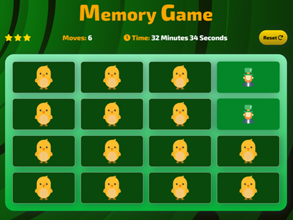

# Motaz Abdou - Milestone Project 2 - Memory Game
Memory Game  

  

[Link to Live Website](https://motazabdou.github.io/MS2-MemoryGame/)

  

[GitHub Repo](https://github.com/motazabdou/MS2-MemoryGame) 

  

***  

  

## About   

  

This is a simple Memory Game Web Application created for my MS2 project with Code Institute. The game is designed to test a user's memory and is made up of a deck of cards, each card containing an image assigned randomly.

 ## Challenge
 
 The challenge is to match all the cards in as little time as possible, making the fewest selections possible

*** 

## Instructions

* Click on a card

* Continue revealing cards and working your memory to remember each unveiled card.

* Match cards properly with less moves and in faster time

  

## Index – Table of Contents 

  

* [User Experience (UX)](#user-experience)  

* [Features](#features) 

* [Designs](#designs) 

* [Technologies Used](#technologies-used) 

* [Testing](#testing) 

* [Deployment](#deployment) 

* [Acknowledgements](#credit) 

  

***  

  

